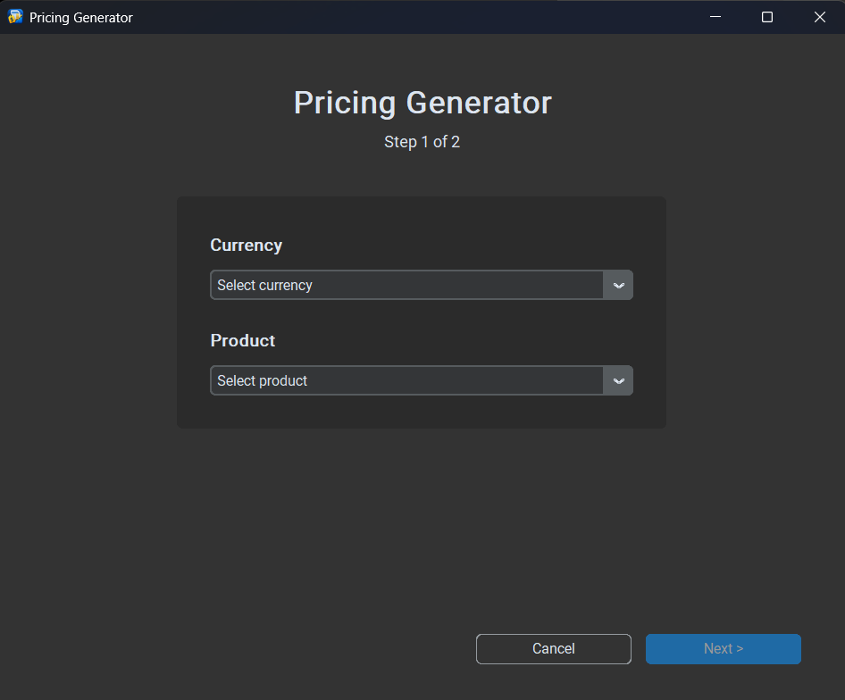
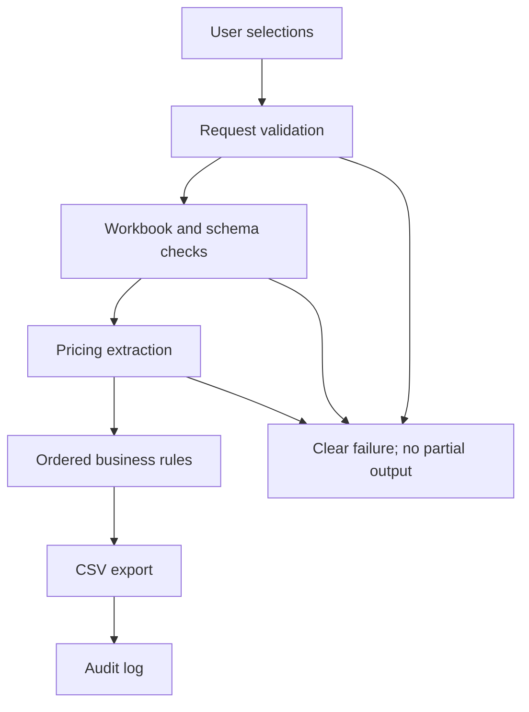
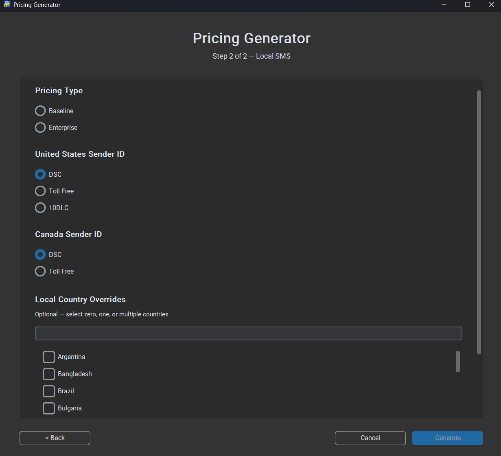

# Pricing Generator

A configuration-driven Python desktop application that transforms structured Excel pricing into validated, upload-ready CSV files.



## Business problem

Preparing one pricing upload manually took a team member at least five minutes. The person also needed to know where approved prices were stored, which pricing type to use, how market-specific rules worked, and the exact structure required by the upload template. Manual copying and formatting created a risk of uploading incorrect client pricing.

I built the Pricing Generator to convert that specialist workflow into a guided desktop application. A user selects a currency, product, and relevant options; the application validates the request and source workbook, applies the configured rules, and generates the required CSV plus an audit record.

## Impact

- Saves at least five minutes for every generated file.
- Enables users without specialist pricing or template knowledge to create upload-ready files.
- Replaces manual price copying and template formatting with a consistent process.
- Reduces the risk of incorrect client pricing uploads through schema checks, deterministic rules, and validation before export.
- Supports USD, EUR, and BRL from one application.

No error-reduction percentage is claimed because errors were not formally measured before and after implementation.

## Portfolio demo

This public repository contains the application source and fictional demonstration data. All prices in `demo_data/` are synthetic and do not represent commercial pricing. Real workbooks, production outputs, logs, usernames, local paths, and the deployed executable are excluded.

The demo exposes two products and the main engineering patterns used by the deployed workflow:

- Baseline and Enterprise pricing
- optional US and Canadian sender-specific overrides
- optional local-country pricing
- USD, EUR, and BRL workbook selection
- validated CSV export and audit logging

## Application workflow





## Technical design

| Layer | Responsibility |
|---|---|
| UI | Collect selections and display validation/results |
| Controller | Validate and coordinate a generation request |
| Application services | Load pricing data and assemble product output |
| Domain engine | Apply base, sender, and local-price rules in order |
| Infrastructure | Read Excel, write CSV, resolve paths, and create logs |
| Models | Carry typed request, pricing, and result data |

Key design decisions:

- External JSON files define products, currencies, countries, workbook schemas, output behavior, and logging.
- Prices use `Decimal` in the domain and export layers.
- Workbook headers and required fields are checked before processing.
- Business rules are isolated from the GUI and Excel-reading code, allowing in-memory unit tests.
- A failed validation does not create a partial upload file.
- Audit-log failure does not hide the original application result.

More detail is available in [the architecture notes](docs/architecture.md).

## Technology

- Python 3.11+
- pandas
- openpyxl for the public `.xlsx` demo
- python-calamine for `.xlsb` support
- CustomTkinter
- `Decimal`, dataclasses, JSON, CSV, and unittest
- PyInstaller in the deployed Windows version

## Run the demo

```bash
git clone https://github.com/urossrb99petrovic-beep/pricing-generator.git
cd pricing-generator
python -m venv .venv
```

Activate the environment:

```powershell
# Windows PowerShell
.venv\Scripts\Activate.ps1
```

```bash
# macOS or Linux
source .venv/bin/activate
```

Install and start:

```bash
python -m pip install -r requirements.txt
python main.py
```

Generated files are written to `demo_output/`; audit files are written to `demo_logs/`. Both folders are ignored by Git.

## Run the tests

```bash
python -m unittest discover -s tests -v
```

The test suite covers configuration loading, fictional workbook extraction, base-price selection, sender override behavior, and explicit failure for unsupported pricing types.

## Repository structure

```text
app/                         application source
Administration/Configuration/1.0.0/
                             fictional public configuration
demo_data/                   fictional USD, EUR, and BRL workbooks
docs/                        architecture and screenshots
tests/                       unit and demo-integration tests
main.py                      application entry point
requirements.txt             Python dependencies
```

## My role

I translated the operational workflow and pricing rules into the application design, implemented the Python modules and validation paths, and iterated on edge cases through testing. I am prepared to explain the architecture, rule precedence, validation strategy, and trade-offs in an interview.

## What I would improve next

- Add structured telemetry for generation volume, duration, validation failures, and estimated time saved.
- Replace desktop distribution with an authenticated internal web application if the user base grows.
- Expand regression tests around simultaneous local and sender overrides.

## License

The portfolio demo is available under the [MIT License](LICENSE). The fictional prices are provided only to demonstrate application behavior.
