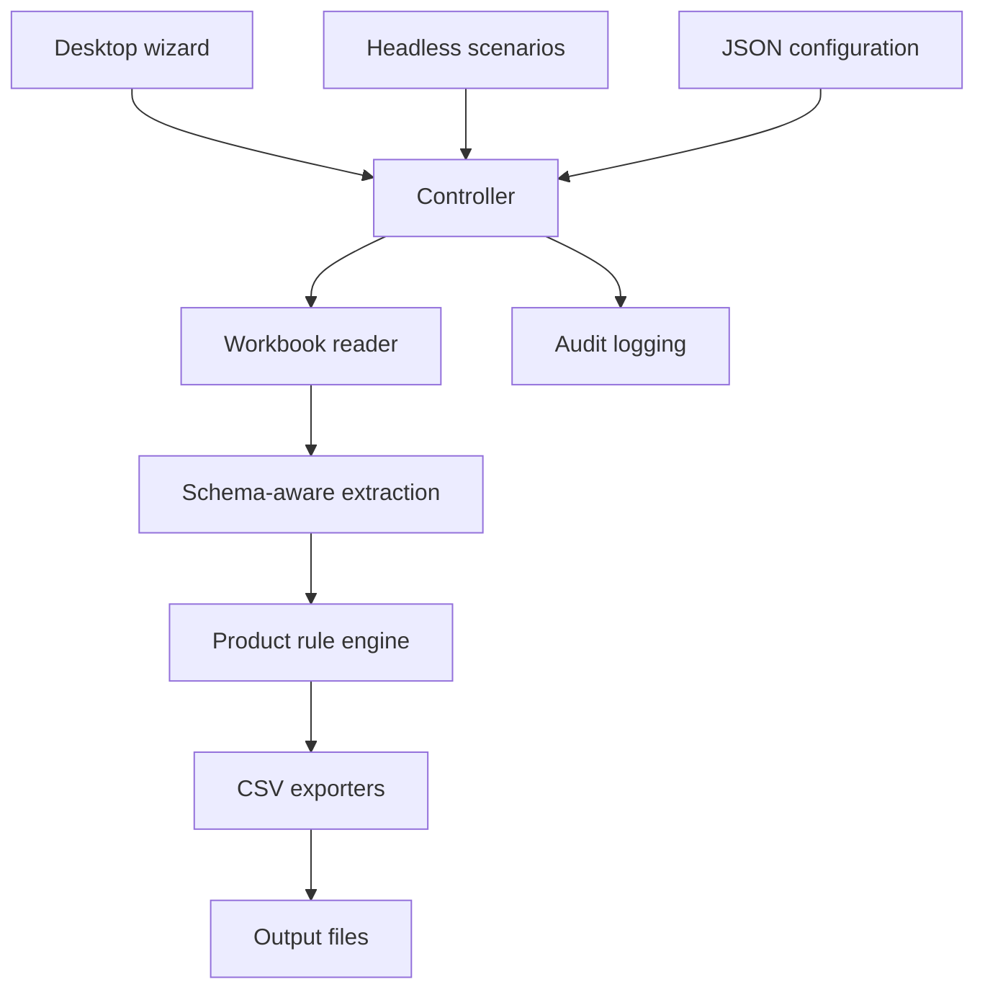

# Architecture and trade-offs

The v1.3.1 application is retained, with a flat repository entry point and fictional workbook routing for reproducibility.

The controller validates requests, selects the correct workbook and product service, and coordinates exports. The workbook layer handles disk reads through pandas/Calamine and retains the original Windows Excel COM fallback. Extraction resolves grouped headers and aliases into typed rows; the generation engine applies deterministic product rules using Decimal values.

SMS applies base pricing, then sender overrides, then selected local prices. Voice chooses an export layout from product options. Mobile produces independently filtered outputs. WhatsApp reads its universal Other fee. Viber derives country prices from costs and margin. Phone ID Suite maps selected subproducts to separate files and omits unavailable prices.

JSON makes catalogs, paths and schemas configurable, but new product families still need Python extraction and engine support. Configuration alone is not a universal plug-in system.

## Reliability boundaries

Validation and generation occur before an export is requested. Existing engine and export tests verify schema and selection behavior, and the portfolio integration matrix exercises actual files. This does not make writes transactional: an I/O failure mid-batch can leave earlier files. Audit failures are intentionally non-fatal. Those are inherited design trade-offs and are documented rather than hidden.

The GUI reset regression is testable without a screen. A Windows interaction smoke test remains necessary for native scaling, dialogs and Excel fallback. The demo deliberately avoids introducing new pricing logic while making the existing application reproducible.
